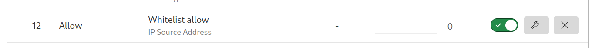
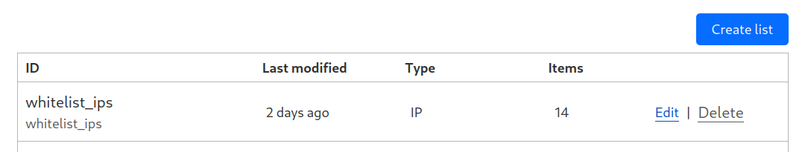
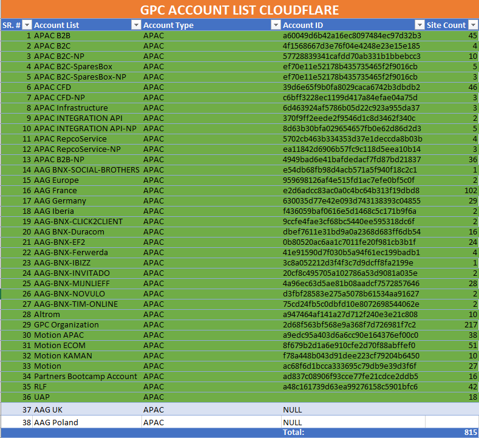

# Ticket: GPC WhiteListing for Whitehat and Qualys

This ticket has been through several steps:

* Collect the Curl commands needed for the operations and test them.
* Create access rules on the firewall per IPs and develop first script to analize the system.
* Create custom rulsets and custom rules adding some more features to the script.
* After we received the the xlsx with the account list we could start doing some more specific tests.
* Build the script in a more fashionable language and add control errors and refine functions.
* Test different use cases and to control the program exception ( can be improved )
* Check output logs functionality while doing more tests.
* Rule deployment by phases, the nº of rules deployed have been increased in each phase reaching more than 200 rules in one go.
* For reference, I've got a rate of 45 rules every 2 minutes aprox (depends on the box and the connection)

<br>

Here is how it looks like the applied rule.



<br>

Down below the Ip list created.



<br>

And all zones have been deployed successfully.




Here is the tool we have developed to accomplish the task and possible future related tasks.

## Current version Cloudflare_V6

This tool has been developed in Python, is inteded to apply the rules we create for all the zones of a given account

* To run the tool python has to be installed on the local box.
* An Account_list.csv has to be placed in the same directory of the tool and add all accounts.
* In case we want to link a rule with a list of ips, the iplist, has to be created manually.
* Proper credentials minimum of email and API key have to be provided.
<br>

### With this tool you can:

* Add Rules to all the zones for a list of accounts given.
* List DNS Records for all the given accounts.
* Log operations for the rules (basic).
* Log for every account given its DNS records and save them in a file by account_id.
* Error trace
* Can create Lists ( adding ips to the list not yet implemented )
* Also some other functionalities need to follow the code.


If you put in the CSV file an account which you don't have visibility it will ignore that Account zone \
The explanation is simple, it's just not shown on the users CF dashboard so it can not be found \

_This means to operate on that zone you need to change the EMAIL and X-Auth-api for valid credentials_

<br>

Log file example, before creating a rule, a filter is needed we link filter id with zone_id.


``` bash
filter b610bd47f0ae4181a30272a2c41d9850 created to zone 19e1d43779273859876d2867eef2a62d
rulefe1f5c203be34b6a8861faa7c5b97b93created to zone 19e1d43779273859876d2867eef2a62d
filter 0a93c56d6b814f499a53c56c7b6d4813 created to zone 1b4d01963dd24298f57c74696680d3d6
rule9a09a84bbcaa456084bd366c22f088bacreated to zone 1b4d01963dd24298f57c74696680d3d6
filter a79406548f564eec809db639073c2725 created to zone 19e1d43779273859876d2867eef2a62d
rule6729f357e24b4e86ba5e5e0fc35de336created to zone 19e1d43779273859876d2867eef2a62d
filter 9c2353baddcf4bc48ccb414a5c51eb48 created to zone 1b4d01963dd24298f57c74696680d3d6
rule905ac8f281bb4009bc2cfb0f29692877created to zone 1b4d01963dd24298f57c74696680d3d6
filter a39983d3018e4da88793d20bfa24032c created to zone 19e1d43779273859876d2867eef2a62d
rule2fc00631195442eab821dae9ee4de91fcreated to zone 19e1d43779273859876d2867eef2a62d
filter 8bef4cf699e54419aa7d4ab4442fdc6e created to zone 1b4d01963dd24298f57c74696680d3d6
rule4edb9ddb89914de4a180b448a1547ec8created to zone 1b4d01963dd24298f57c74696680d3d6


##### Log from console.txt#####
Enter the number to operate:
1
ced70bca44e74e139ec0e01278d5cf2f rule created
aa01cce418b542dc9559fa8041dfed60 rule created
d04465edcbb4413882a1aac72c9d5bb2 rule created
09c7f725ccd6451b942d372604258f7a rule created
2ab933daaeee4e10b361a9e72b69ba81 rule created
afab7fcf8c9943a3b47aab756c7de418 rule created
565ae6914fe7476bb334316363f5d870 rule created
d1e5c041367741f3995fe52258286f8c rule created
252df1bf59c24a378c1bb0d73c77ed5e rule created
96e8ae76e47e421c84a163ba1782a275 rule created
772f62aba9d24542aa1110e104b046ce rule created
9324c477e0a6455ba1d076d5aec10360 rule created
60bf1e8eeb734449b8faf9763cfc9fe4 rule created
a84d982105a54b1fb360b4ad1b496c41 rule created
63f1edab108f47d7a2ec09055177cbab rule created
5bce350c4737485599f88c1db00cd283 rule created
ae31b6e9a90840458a5a6ff1ee22bbad rule created
3d92cd73bbcb4da2a337cb447976f7b2 rule created
fcdb589a10944a69a4c689f2419e8187 rule created

```


 ## The code of tool used to complete the task


``` python

#This module define commands to get info from cloudfare

import subprocess, json
from inspect import stack 

def bash_echo_o_curl(curl_parameters):
    if echo_o_curl == 'curl':
        command = 'curl ' + curl_parameters
        return command
    else:
        command = 'echo "' + curl_parameters + '"'
        return  command


class Cloudflare:
    #This class implement functions to read/write to/from cloudflare.com
    def __init__(self):
        self.cloudflare_response = None
        
    def execute_command(self, command):
        #executes command and check errors. returns True if no error and False if error
        command_response = subprocess.run(command, shell=True, capture_output=True, text=True )  #response subprocess.run() = [.stdout, .returncode, .stderr, .args **args es el comando shell que li passem**]
        check_errors.check_command_error(command_response)
        self.cloudflare_response = json.loads(command_response.stdout) #Output json converted to a dictionary
        no_error = check_errors.check_response_error(self.cloudflare_response) #Process the error returns True if no error
        return no_error
    
    def list_dns(self, zone_id):
        command = bash_echo_o_curl('-X GET "https://api.cloudflare.com/client/v4/zones/' + zone_id + '/dns_records/export"' \
                                ' -H "Content-Type: application/json" ' + \
                                '-H "X-Auth-Email: ' + email + '" -H "X-Auth-key: ' + x_auth_key + '"')
        command_response = subprocess.run(command, shell=True, capture_output=True, text=True )  #response subprocess.run() = [.stdout, .returncode, .stderr, .args **args es el comando shell que li passem**]
        check_errors.check_command_error(command_response)
        self.cloudflare_response = command_response.stdout #Output json converted to a dictionary
        print(self.cloudflare_response)
        return self.cloudflare_response
        

    def list_zones(self, account_id):
    #Returns a list with all the zones of the account_id, or False if there are errors or an empty list#' + account_id + '
      command = bash_echo_o_curl('-X GET "https://api.cloudflare.com/client/v4/zones/?account.id=' + account_id  +  '" -H "Content-Type: application/json" ' + \
                                 '-H "X-Auth-Email: ' + email + '" -H "X-Auth-key: ' + x_auth_key + '"')
      no_error = self.execute_command(command)
      if no_error:
            #total pages per_page
            if self.cloudflare_response['result'] != []:
                total_pages = self.cloudflare_response['result_info']['total_pages']
                total_count = self.cloudflare_response['result_info']['total_pages']
                count = self.cloudflare_response['result_info']['count']
                page = self.cloudflare_response['result_info']['page'] + 1 
                llista: list = self.cloudflare_response['result']
                while True:
                    if page <= total_pages:
                        command = bash_echo_o_curl('-X GET "https://api.cloudflare.com/client/v4/zones/?account.id=' + account_id +'&page='+ str(page) +'' '" -H "Content-Type: application/json" ' + \
                                                   '-H "X-Auth-Email: ' + email + '" -H "X-Auth-key: ' + x_auth_key + '"')
                        self.execute_command(command)
                        llista = llista + self.cloudflare_response ['result']
                        page = page +1  
                    else:
                        break
                return [result['id'] for result in llista]
            print("No zones found for this account:\n" + account_id +\
                  "\nThe given authentication credentials are right, but there's no visibility over this account.\n")
            exit()

    def list_filters(self, zone):
        command = bash_echo_o_curl('-X GET "https://api.cloudflare.com/client/v4/zones/' + zone + '/filters"'\
                                + ' -H "Content-Type: application/json" -H "X-Auth-Email: ' + email + '"'\
                                + ' -H "X-Auth-key: ' + x_auth_key + '" -d \'{}\'')
        no_error = self.execute_command(command)
        if no_error:
            if self.cloudflare_response['result'] != []:
            #If the query is successful and have one or more results create a list with the zones_IDs and returns it
                return  [(result['id'], result['expression']) for result in self.cloudflare_response['result'] ] #cloudfare_response['result'] >>> List dictionaries per each zone
            else:
            #If the query is successful and no have results means that the given credentials don't have visibility over the account
                print("No filters found for the the zone: " + zone)
                return []
        else:
            return []


    def create_filter(self, zone_id):
        #Returns a tuple(True, filter_id) if the connection is succesful, else returns tuple(False, error message)
        command = bash_echo_o_curl('-X POST "https://api.cloudflare.com/client/v4/zones/' + zone_id + '/filters" \
                                    -H "Content-Type: application/json" -H "X-Auth-Email: ' + email + '" \
                                    -H "X-Auth-key: ' + x_auth_key + '" \
                                    -d \'[{"expression":"XXXXXXXX CHANGE ME XXXXXXXXX","description":"XXXXXXXX CHANGE ME XXXXXXXXX"}]\'')
        no_error = self.execute_command(command)
        if no_error:
            strng = 'filter ' + self.cloudflare_response['result'][0]['id'] + ' created to zone ' + zone_id + '\n'
            rw_files.write_log(strng)
            return self.cloudflare_response['result'][0]['id']
        else:
            return self.cloudflare_response['errors'][0]['code']


    def create_rule(self, filter_id, zone_id):
        #Returns a tuple(True, filter_id) if the connection is succesful, else returns tuple(False, error message)
        command = bash_echo_o_curl('-X POST "https://api.cloudflare.com/client/v4/zones/' + zone_id + '/firewall/rules"'\
                                ' -H "Content-Type: application/json" -H "X-Auth-Email: ' + email + '" '\
                                    '-H "X-Auth-key: ' + x_auth_key + '" '\
                                    '-d \'[{"filter":{"id": "' + filter_id + '"},"action": "XXXXXXXX CHANGE ME XXXXXXXXX", "description": "XXXXXXXXXXX CHANGE ME  XXXXXXXXXXXXX"}]\'')
        no_error = self.execute_command(command)
        if no_error:
            strng = 'rule' + self.cloudflare_response['result'][0]['id'] + 'created to zone ' + zone_id +'\n'
            rw_files.write_log(strng)
            print(self.cloudflare_response['result'][0]['id'], 'rule created')
            return (True, self.cloudflare_response['result'][0]['id'])
        else:
            print('Oops!!!!! something went wrong bro',self.cloudflare_response['errors'][0]['message'] )
            return False

    def remove_filter(self, filter_id, zone_id):
        #Returns a tuple(True, filter_id) if the connection is succesful, else returns tuple(False, error message)
        command = bash_echo_o_curl('-X DELETE "https://api.cloudflare.com/client/v4/zones/' + zone_id + 
                                '/filters/' + filter_id + '" -H "Content-Type: application/json" '\
                                '-H "X-Auth-Email: ' + email + '" -H "X-Auth-key: ' + x_auth_key + '"')
        no_error = self.execute_command(command)
        if no_error:
            print(self.cloudflare_response['result']['id'] + ' filter/rule deleted')
        else:
            pass
    
    def create_list(self,account):
        #Returns a tuple(True, filter_id) if the connection is succesful, else returns tuple(False, error message)
        command = bash_echo_o_curl('-X POST "https://api.cloudflare.com/client/v4/accounts/' + account + '/rules/lists" \
                                   -H "Content-Type: application/json" -H "X-Auth-Email: ' + email + '" -H "X-Auth-key: ' + x_auth_key + '" \
                                   -d \'{"description": "Whitelist Whitehat and Qualys.", "kind": "ip","name": "whitelist_ips"}\'')
        no_error = self.execute_command(command)
        if no_error:
            print("List created.\n")
          
        else:
            pass
     
class RW_files:
    def get_accounts_target_lst(self):
        with open('Account_list.csv') as account_list_csv: 
            accounts_target_text = account_list_csv.read()
            #This line is to delete a control character, it was at the begining of the csv but it's invisible from an editor
            accounts_target_text = accounts_target_text[0:] 
            accounts_target_lst = accounts_target_text.split()
            return accounts_target_lst
        
    def write_log(self, log_str):
        with open('log.txt', 'a') as log:
            log.write(log_str)
        

class Check_Errors:
    def __init__(self):
        self.error_found = False
        self.no_error_found = True


    def check_command_error(self, command_response):
        caller_function = stack()[2].function #We know it calls a check_command_error
        error_index = command_response.stderr.find('curl') #Only if the command has an error, the name 'curl' will appear. and find() will return the index, if curl is not found by  find() will return -1
        if  error_index != -1: #i.e. si troba un error del curl:
            print(command_response.stderr[error_index:]) #print error description
            print('Check that the curl command is spelled correctly in the "', caller_function, '"function')
            exit()

    def check_response_error(self, cloudflare_response):
        caller_function = stack()[2].function
        if cloudflare_response['success'] == False:
            error_messages = [errors['message'] for errors in cloudflare_response['errors']]
            error_codes = [errors['code'] for errors in cloudflare_response['errors']]
            rw_files.write_log(str(error_messages) + '\n')
            print('function', caller_function, error_messages)
            
            if 9103 in error_codes or 10000 in error_codes:
                self.process_auth_error()
            
            if 10102 in error_codes: #filtre already exist
                self.process_duplicate_filter()
                

            return self.error_found
        else:
            return self.no_error_found
        
    def process_auth_error(self):
        print('Please, write valid credentials')
        exit()

    def process_duplicate_filter(self):
        pass


class Jobs:
    def insert_filter_rule_to_targeted_zones(self):
        accounts_target_lst = rw_files.get_accounts_target_lst() 
        for account in accounts_target_lst:
            lst_zones = cloudflare.list_zones(account)
            if lst_zones == False:
                continue
            for zone in lst_zones:
                filter_id = cloudflare.create_filter(zone)
                if isinstance(filter_id, int):
                    continue
                else:
                    cloudflare.create_rule(filter_id, zone)
    def delete_filter_rule_to_targeted_zones(self):
        accounts_target_lst = rw_files.get_accounts_target_lst() 
        for account in accounts_target_lst:
            lst_zones = cloudflare.list_zones(account)
            if lst_zones == False:
                continue
            for zone in lst_zones: 
                filters_tuple = cloudflare.list_filters(zone)
                for filter in filters_tuple:
                    if filter[1] == 'ip.src in $whitelistgpc':
                        cloudflare.remove_filter(filter[0], zone)

    def list_dns(self):
        account_list = rw_files.get_accounts_target_lst()
        for account in account_list:
            dns_log = 'dns_log_' + account + '.txt'
            with open(dns_log,"w") as log:
                zone_list = cloudflare.list_zones(account)
                for zone in zone_list:
                    log.write(cloudflare.list_dns(zone) + '\n' + '####################################################################'.center(80) + '\n')
    
    def create_list(self):
        account_list = rw_files.get_accounts_target_lst()
        for account in account_list:
            create_lst = cloudflare.create_list(account)
            return create_lst
            
                    
def start_menu():
    
    print("::::::::::::::::::::::::::::::::::::::::::::::::::::::::::::::::::::::::::::::::")
    print("::::::::::::::: CloudFlare Internal Team API Framework interaction ::::::::::::::")
    print(":::::::::::::::::::::::::::::::::::::::::::::::::::::::::::::::::::::::::::::::::")


    print("Which of the follwing actions you want to perform\n")
    print("1. Create rules for all zones of given accounts.\n")
    print("2. List/Log DNS Records for all zones of given accounts.\n")
    option = input("Enter the number to operate:\n")
    return option
        
  
### HERE BEGINS THE SCRIPT'S MAIN FLOW ###

# account = "<ADD CREDENTIALS>"
# email = "<ADD CREDENTIALS>"
# x_auth_key = "<ADD CREDENTIALS>"


echo_o_curl = 'curl'
cloudflare = Cloudflare()
rw_files = RW_files()
check_errors = Check_Errors()
jobs = Jobs()
option = start_menu()
if option == '1':
    jobs.insert_filter_rule_to_targeted_zones()    
elif option == '2':
    jobs.list_dns()
else: 
    print("You typed the wrong number.")
exit()


```

